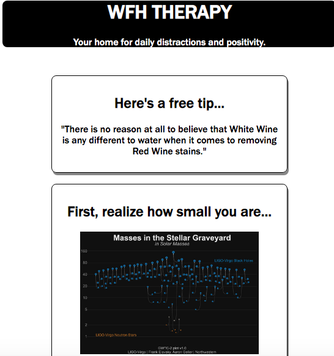

# WorkFromHome-Therapy
Live App: https://schmita91.github.io/workFromHomeTherapy/

Summary
This project uses RESTful APIs to fetch pleasant distractions from around the web, such as the NASA APOD,
random dog pictures, bite-sized advice, and an activity generator. The app's intent is to be a light-hearted,
5-minute distraction for those working at a computer, likely from home, during the COVID-19 pandemic. 

Key Technologies:
HTML, CSS, JS
jQuery

